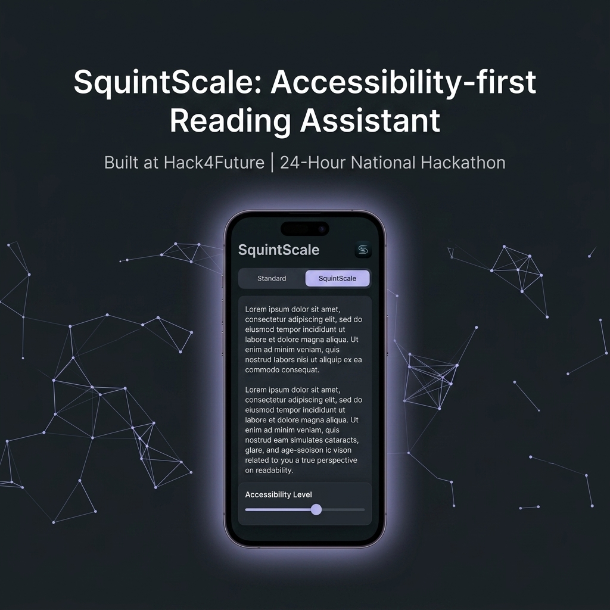
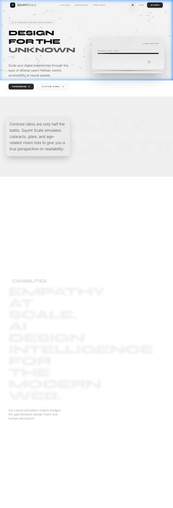
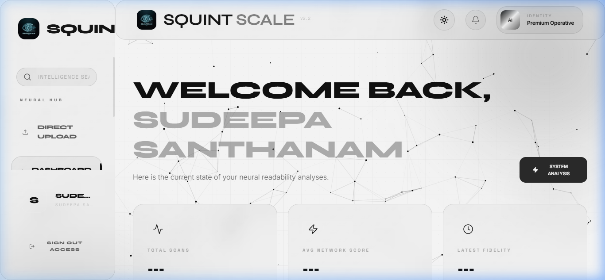
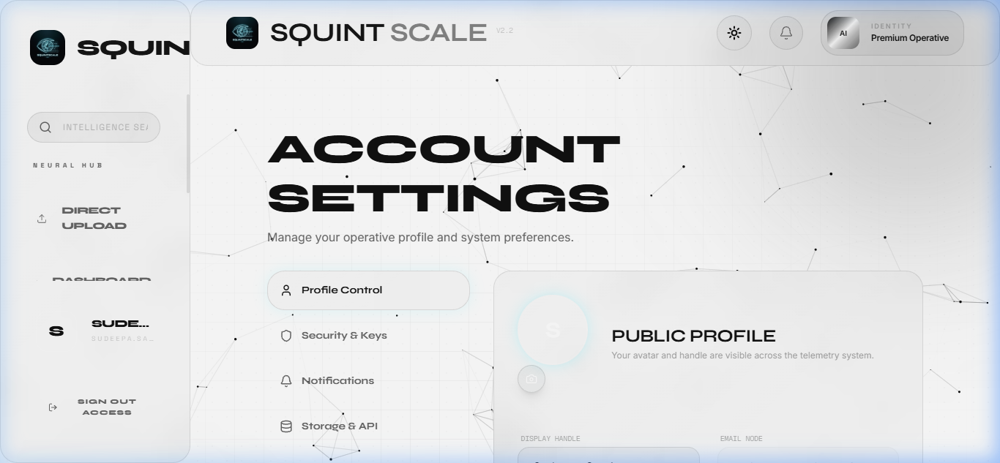
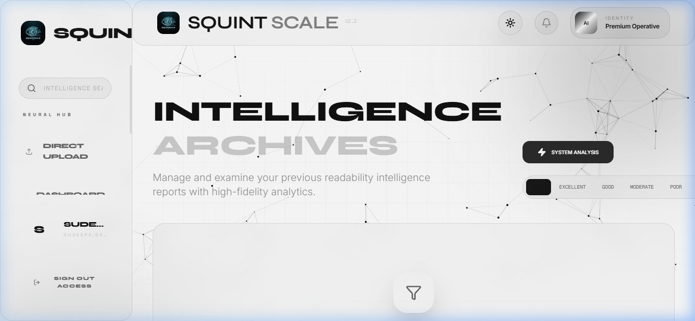
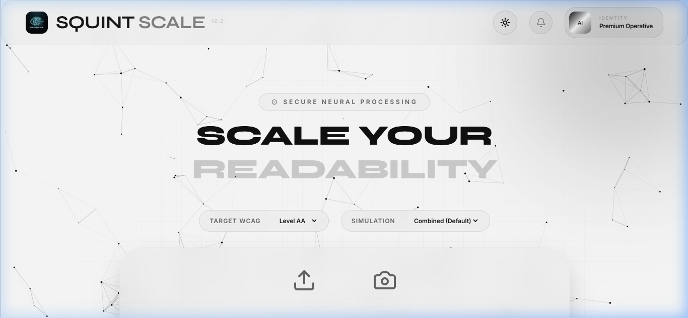
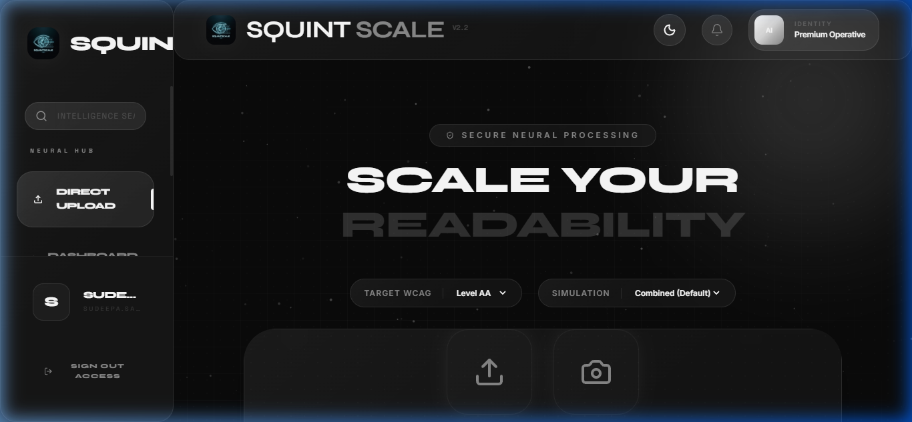

# SquintScale: Accessibility-First Reading Assistant 🚀

Built in 24 Hours at the **Hack4Future** National Level Hackathon.

## ✨ Features

- **📸 Camera Scan**: Instant OCR for physical documents.
- **📄 Document Upload**: Support for PDF and image-based reading.
- **🌐 URL Article Reader**: Distraction-free reading for any web content.
- **🧠 Focus Modes**: ADHD Focus Mode & Dyslexia Friendly Mode.
- **📊 Analytics**: Track your reading habits and focus sessions.
- **🌙 Premium UI**: Glassmorphic dark mode for visual comfort.

## 📸 Screenshots

| Home Screen | Analytics | Settings |
|:---:|:---:|:---:|
|  |  |  |

| History | Reading Session | Accessibility |
|:---:|:---:|:---:|
|  |  |  |

## 🛠️ Tech Stack

- **Frontend**: React 19, Vite, Framer Motion, Tailwind CSS
- **Backend**: FastAPI (Python 3.11), PostgreSQL
- **Auth & Database**: Supabase
- **DevOps**: Docker, Docker Compose
- **Typography**: Inter, Outfit, JetBrains Mono

## 🏗️ Architecture Overview

SquintScale uses a distributed architecture designed for speed and reliability:
1. **React Frontend**: A highly responsive "glassmorphic" interface using Framer Motion for smooth 3D transitions.
2. **FastAPI Backend**: A high-performance Python API that handles text extraction and neural simulation.
3. **Supabase Integration**: Real-time authentication and secure storage for user reading history.
4. **Dockerization**: The entire stack is containerized for seamless deployment across any environment.

## 👥 The Team

- **Sneha Varghese**: Mobile App Development & UI/UX Design
- **Sudeepa Santhanam**: Backend Infrastructure & Docker Deployment
- **Akashdeep Dey**: Frontend Integration & Routing Architecture

## 🚀 Future Improvements

- [ ] AI-powered text summarization for quick previews.
- [ ] Multilingual support for global accessibility.
- [ ] Voice-over integration for auditory learning.
- [ ] Offline reading mode for documents.

## 🏆 Hackathon Details

- **Event**: Hack4Future National Level Hackathon
- **Organizer**: Department of Computer Science & Applications, Christ Academy Institute for Advanced Studies
- **Timeline**: 24 Continuous Hours
- **Status**: Production-Ready Deployment

---

© 2026 SquintScale Team | Built with ❤️ for Accessibility.
